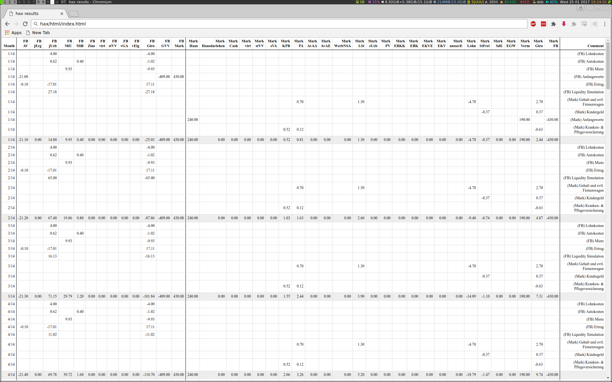

# hax [](https://travis-ci.org/johannesgerer/hax) [](https://hackage.haskell.org/package/hax)
A library for cash-flow and tax simulations. The type system is used to ensure correctness e.g. of double-entry accounting, and the correct calculation of taxes. The use of Haskell's `do`-notation and type-classes permit an almost verbatim translation of the tax code into the program.

It currently includes personal income tax (Einkommensteuer), corporate tax (Körperschaftsteuer) and trade/business tax (Gewerbesteuer), but could easily be extended to other legal systems

## Usage

```
stack runghc -- -isrc src/main
```

will produce a folder named `html` containing the results of the [HAX.Example](src/HAX/Example.hs) that commes with this library. The look at the full ledger in `html/index.html` or the charts `static/charts.html`.

## Documentation

The docs on [Hackage](https://hackage.haskell.org/package/hax) are quite comprehensive (with some parts in German).


## Srceenshots



Charts


